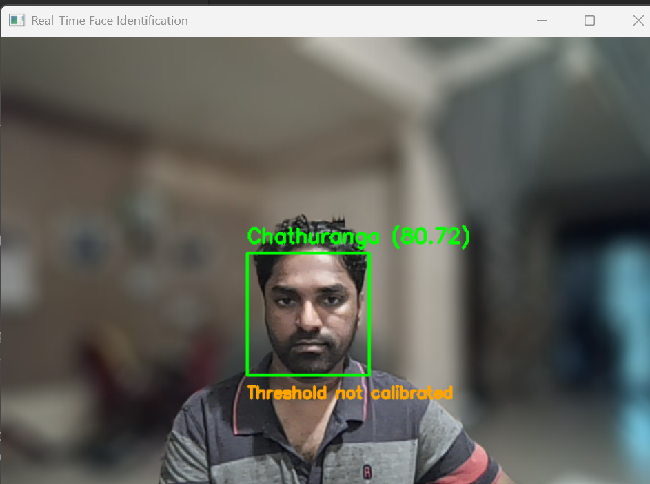
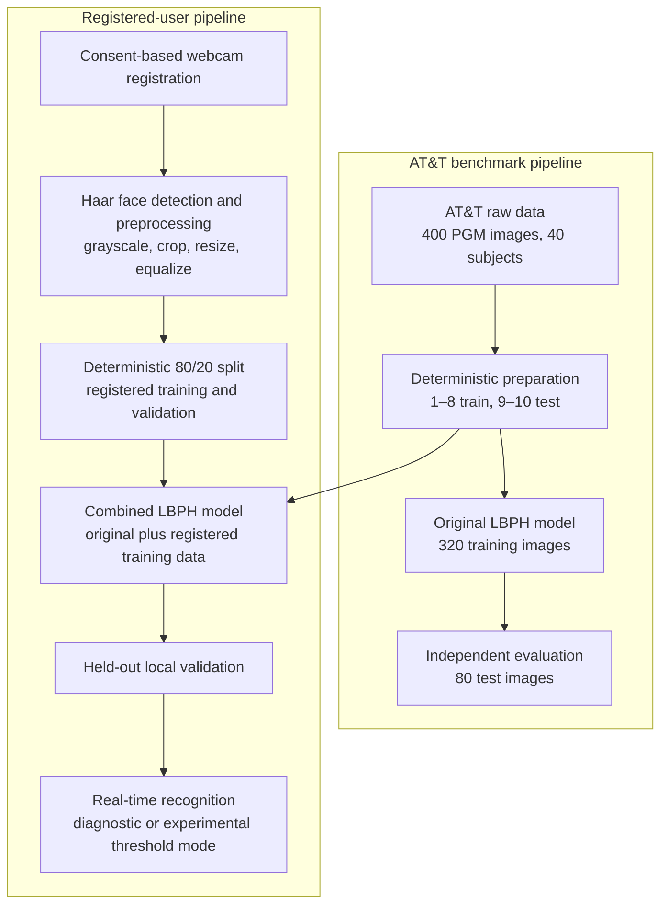

# OpenCV Face Recognition System

A complete, reproducible face-recognition workflow built with Python and OpenCV's Local Binary Patterns Histograms (LBPH) recognizer. The project prepares the AT&T Database of Faces deterministically, trains and evaluates a baseline model, registers a new user with informed consent, retrains a combined model, validates that identity on held-out images, and supports real-time webcam identification.

This is an educational classical computer-vision project. It does not use deep learning, and its experimental unknown-face threshold is not suitable for security authentication.

## Demo



The demo shows **Chathuranga** as the closest registered identity returned by the combined LBPH model. The displayed value is an **LBPH distance**, not a probability or confidence percentage; lower values generally indicate a closer match to the learned face patterns. When the interface displays **Threshold not calibrated**, it is running in diagnostic mode and reporting the closest known identity without rejecting it. Unknown-face rejection is available only as an experimental threshold mode and is not considered calibrated.

## Features

- Deterministic AT&T dataset preparation with numeric subject and image ordering
- Strict validation of image readability, dimensions, grayscale format, labels, and sample counts
- Reproducible training/test split: images `1.pgm`–`8.pgm` for training and `9.pgm`–`10.pgm` for testing
- OpenCV LBPH model training with explicit, recorded parameters
- Independent test-set evaluation with accuracy, per-class results, confusion matrix, distance statistics, and prediction records
- Consent-based webcam registration using Haar-cascade face detection
- Standardized face preprocessing: grayscale crop, resize to `112 × 92`, and histogram equalization
- Deterministic 80/20 split of registered images into training and held-out validation sets
- Combined training that preserves the original 40 labels and adds registered identities deterministically
- Held-out local-user validation with per-image labels and LBPH distances
- Real-time diagnostic recognition and optional experimental unknown rejection
- Headless evaluation plotting and focused automated tests

## Verified Results

### AT&T evaluation

| Metric | Verified result |
|---|---:|
| Images | 400 |
| Subjects | 40 |
| Training samples | 320 |
| Independent test samples | 80 |
| Correct predictions | 77 |
| Incorrect predictions | 3 |
| Test accuracy | **96.25%** |

The AT&T result uses two held-out images per subject. No test image is used to train the original LBPH model.

### Registered identity and combined model

| Metric | Verified result |
|---|---:|
| Registered identity | Chathuranga |
| Assigned label | 40 |
| Registered training samples | 16 |
| Held-out local validation samples | 4 |
| Combined training samples | 336 |
| Combined classes | 41 |
| Local validation result | **4/4 correct (100%)** |

The local validation result is encouraging but limited: it contains only four images of one person captured during the same registration session. It does not demonstrate robustness across different cameras, rooms, lighting conditions, poses, dates, or unknown people.

### Automated tests

| Environment | Result |
|---|---:|
| WSL/Linux | **66 passed** |
| Native Windows | **66 passed** |

## System Workflow



## Repository Structure

```text
.
├── docs/
│   └── images/
│       └── realtime-recognition-demo.png
├── src/
│   ├── create_preview_grid.py
│   ├── evaluate_model.py
│   ├── inspect_image.py
│   ├── prepare_data.py
│   ├── prepare_registered_training.py
│   ├── realtime_recognition.py
│   ├── register_face.py
│   ├── train_combined_model.py
│   ├── train_model.py
│   └── validate_registered_model.py
├── tests/
│   ├── test_evaluate_model.py
│   ├── test_prepare_data.py
│   ├── test_prepare_registered_training.py
│   ├── test_realtime_recognition.py
│   ├── test_register_face.py
│   ├── test_train_combined_model.py
│   ├── test_train_model.py
│   └── test_validate_registered_model.py
├── .gitignore
├── requirements.txt
└── README.md
```

Runtime data, trained models, evaluation reports, registered faces, and webcam screenshots are generated locally and intentionally excluded from version control.

## Installation

Python 3.12 was used for the verified Windows and WSL runs. The pinned dependencies use the stable OpenCV contrib release `4.10.0.84`, which includes `cv2.face`.

### WSL or Linux

```bash
python3 -m venv .venv
source .venv/bin/activate
python -m pip install --upgrade pip
python -m pip install -r requirements.txt
```

### Windows PowerShell

```powershell
py -3.12 -m venv .venv-windows
.\.venv-windows\Scripts\Activate.ps1
python -m pip install --upgrade pip
python -m pip install -r requirements.txt
```

Dataset preparation, training, evaluation, and tests can run in either environment. Use **native Windows Python** for webcam registration and real-time display when working from WSL, because webcam access and `cv2.imshow` are not consistently available through WSL.

## Dataset Setup

The benchmark data is the [AT&T Database of Faces on Kaggle](https://www.kaggle.com/datasets/kasikrit/att-database-of-faces), distributed as 40 subject folders with 10 grayscale PGM images per subject.

After configuring Kaggle API credentials, download and extract it from the repository root:

```bash
kaggle datasets download -d kasikrit/att-database-of-faces -p data/raw --unzip
```

The preparation script expects this direct layout:

```text
data/raw/
├── s1/
│   ├── 1.pgm
│   └── ...
├── s2/
└── ...
    └── s40/
        └── 10.pgm
```

If the archive creates an additional parent directory, move the `s1`–`s40` folders directly under `data/raw/`. The raw dataset is Git-ignored and must not be committed.

## Usage

Run commands from the repository root in the following order.

### 1. Prepare the AT&T dataset

```bash
python src/prepare_data.py
```

This validates all 400 source images and creates deterministic training and test arrays under `data/processed/`.

### 2. Train the original 40-class LBPH model

```bash
python src/train_model.py
```

The original model and its metadata are written under `models/`.

### 3. Evaluate the original model

```bash
python src/evaluate_model.py
```

This evaluates all 80 held-out AT&T test images and writes reports under `outputs/evaluation/`.

### 4. Register a consenting local user

Run this step with native Windows Python when WSL cannot access the webcam or display OpenCV windows:

```powershell
python src/register_face.py --name Chathuranga --samples 20
```

Registration controls:

- `SPACE` captures the selected face.
- `Q` quits early.

The script uses the largest detected face, preprocesses it consistently, and stores the images plus registration metadata under `data/registered_faces/<safe_name>/`. Existing registrations are protected unless `--overwrite` is supplied.

### 5. Prepare combined training and local validation data

```bash
python src/prepare_registered_training.py
```

For 20 numerically named registered images, `001.png`–`016.png` become training samples and `017.png`–`020.png` remain held out for validation. Original labels `0`–`39` remain unchanged; registered folders are sorted alphabetically before new labels are assigned from `40`.

### 6. Train the combined model

```bash
python src/train_combined_model.py
```

This trains `models/lbph_combined_model.yml` from the 320 original training samples and only the 16 registered training samples. It does not overwrite the original model.

### 7. Validate the registered identity

```bash
python src/validate_registered_model.py
```

This predicts the four held-out registered images and writes the validation summary and prediction records under `outputs/registered_validation/`.

### 8. Run real-time diagnostic recognition

Use native Windows Python for reliable webcam and GUI support:

```powershell
python src/realtime_recognition.py --show-distance
```

Diagnostic mode always displays the closest known identity and explicitly warns that the threshold is not calibrated.

Real-time controls:

- `Q` quits.
- `S` saves a screenshot under `outputs/realtime/`.
- `T` toggles the distance display.

### 9. Try experimental unknown rejection

```powershell
python src/realtime_recognition.py --threshold 105 --show-distance
```

`105` is an illustrative starting value, not a validated operating threshold. A reliable unknown-face threshold requires representative unknown identities and broader multi-session validation. Even known faces may be rejected as `Unknown` when capture conditions differ from the registration data.

## Evaluation Outputs

Running `src/evaluate_model.py` creates:

- `evaluation_summary.json` — overall and per-class accuracy, correct/incorrect counts, distance statistics, and known-only threshold analysis
- `predictions.csv` — sample-level true labels, predicted labels, subject names, distances, and correctness
- `confusion_matrix.npy` — the numeric 40-class confusion matrix
- `confusion_matrix.png` — a headless-rendered matrix labeled `s1`–`s40`
- `distance_distribution.png` — correct and incorrect LBPH distance distributions
- `misclassified_samples.png` — misclassified faces when errors exist

Running `src/validate_registered_model.py` creates:

- `validation_summary.json` — held-out local accuracy, labels, and distance statistics
- `predictions.csv` — per-image registered validation predictions and distances

All evaluation outputs are Git-ignored.

## Testing

Run the complete suite from the repository root:

```bash
python -m pytest -q
```

The tests cover deterministic data preparation, validation failures, model persistence, evaluation outputs, registration safeguards, registered-image splitting, combined training, held-out validation, and real-time recognition helpers without requiring a live webcam.

## Technologies

- Python
- OpenCV contrib (`cv2.face`, Haar cascades, image processing, and webcam UI)
- NumPy
- Matplotlib
- Pytest
- Kaggle API

## Privacy and Consent

- Capture a person's face only with informed consent and explain how the images and trained model will be used.
- Registered images, registration metadata, trained models, evaluation outputs, and locally captured screenshots are ignored by Git.
- The single screenshot under `docs/images/` is an intentionally selected public demonstration asset.
- Review generated files before sharing the repository, and remove local biometric data when it is no longer needed.
- Do not use this educational system for surveillance, access control, identity proofing, or other high-impact decisions.

## Limitations

- LBPH is a classical local-texture method, not a modern deep-learning face-embedding system.
- The AT&T dataset is small and was captured under relatively controlled conditions.
- The frontal Haar cascade can miss rotated, partially occluded, distant, or poorly lit faces.
- The registered data currently represents one person and one capture session.
- The four-image local validation set is too small and too similar to the registration conditions to establish real-world generalization.
- The AT&T evaluation and local validation contain known identities only, so they cannot calibrate reliable unknown-person rejection.
- Live behavior has not been validated across multiple people, cameras, rooms, lighting conditions, or sessions.
- LBPH distances are model-specific dissimilarity scores and must not be presented as probabilities.
- This project is educational and is not a security-grade biometric authentication system.
